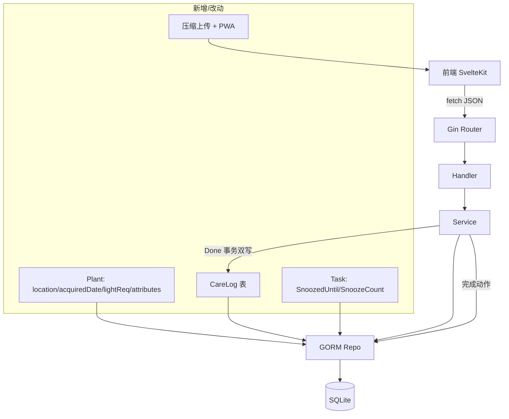

## 用户需求

基于 7 个开源园艺类参考项目（plant-it / hortusfox-web / ferna / petal / loggr / draix-garden / PlantFinder），为"青野"输出**对标分析 + 可落地的改造建议计划**。用户已确认四块优先借鉴方向，全部纳入本次计划：

## 核心改造点

1. **植物主表字段扩充**（参考 hortusfox）：为 Plant 增加 location（购置位置/详细方位）、acquiredDate（入库/获得日期）、lightReq（光照需求）、notes 支持结构化 JSON 等字段，与现有 Room 分组共存不冲突。
2. **养护事件表 care_logs**（参考 plant-it / hortusfox）：将"一次养护动作"建模为独立于 Task 的通用事件表，覆盖"无任务来源的一次性养护动作"（如随手浇水、换盆记录），与现有 task_logs 对齐/重构，统一养护时间线。
3. **提醒可延期 snooze**（参考 ferna）：为 Task 增加 snooze 能力（延期到具体日期/天数），保持模块化，预留传感器/外部触发扩展口。
4. **前端骨架优化**（参考 draix-garden）：强化 Svelte 5 runes 写法规范、新增照片前端压缩上传、引入 PWA（可安装 + 离线缓存），与现有 SvelteKit 架构对齐。

## 产品概述

在不改变"青野"现有任务清单 + 植物收藏 + 照片日记 + 资料库 + 智能规划主线的基础上，补齐数据模型厚度（植物属性、养护事件）、增强提醒灵活度（snooze）、提升前端体验（照片压缩、PWA），使产品更接近成熟自部署园艺工具的完成度。

## 核心功能（本次计划交付）

- 植物详情页支持填写 location / acquiredDate / lightReq / 结构化 notes
- 养护时间线聚合 task_logs 与 care_logs，形成统一"养护记录"
- 任务支持 snooze（延后提醒），前端展示"已延期"
- 新增/编辑植物、上传照片时前端压缩后再上传
- 前端具备 PWA 安装能力与基础离线缓存
- 全部改造向后兼容：CSV 导入、今日任务计算、休息日过滤不受影响

## 技术栈选型

- 后端沿用：Go 1.22 + Gin + GORM + SQLite（gorm.AutoMigrate 自动建表，零部署单文件）
- 前端沿用：SvelteKit（Svelte 5 runes）+ Vite + TypeScript；PWA 采用 `@vite-pwa/sveltekit`（兼容 adapter-auto 的静态/Node 部署）
- 照片压缩：浏览器端 `canvas` + `OffscreenCanvas` 压缩后 `FormData` 上传，不引入新后端依赖
- 数据交互：沿用 `{ code, message, data }` 统一响应；新增接口复用现有 handler/router 模式

## 实现方案

### 总体策略

以"最小侵入、向后兼容"为原则，分四块独立改造，每块都可单独合并验证。所有数据库变更通过 GORM 模型字段追加实现（SQLite 支持 ADD COLUMN），AutoMigrate 自动生效，旧数据无需迁移脚本。

### 关键决策与权衡

1. **Plant 字段扩充**：新增 `Location`、`AcquiredDate(*time.Time)`、`LightReq(string)`、`Attributes(string JSON)` 四字段。`Note` 保留为纯文本摘要，`Attributes` 存结构化扩展（如土壤、湿度偏好），避免破坏现有 note 展示。权衡：不加过多字段，保持精简；JSON 字段用 `type:text` 存，前端按 key 渲染。
2. **care_logs 事件表**：新增 `CareLog` 模型（`PlantID, Type, Title, At, Note, Source(string: manual/task), TaskID?`）。重构 `task_logs` 写入逻辑：任务完成仍写 task_logs（保持现有统计/历史接口不变），同时写入 care_logs 作为统一时间线来源；手动养护（无任务）直接写 care_logs。新增 `GET /api/care-logs?plantId=` 聚合接口。权衡：保留 task_logs 不删，避免动既有"任务历史"页面与 Done 逻辑；care_logs 作为展示层统一源，降低前端两套时间线成本。
3. **snooze**：Task 增加 `SnoozedUntil(*time.Time)` 与 `SnoozeCount(int)`。今日/临近查询时，若 `SnoozedUntil` 在有效期内则跳过展示（顺延语义）。新增 `POST /api/tasks/:id/snooze` 接口，复用现有 Postpone 事务模式但语义独立（仅改提醒展示，不改 next_due 周期）。权衡：与 Postpone 区分——Postpone 改周期计算基准，Snooze 仅隐藏提醒到指定日，到期自动恢复，符合 ferna"可 snooze"思路且不影响重复规则。
4. **前端优化**：

- 照片压缩工具 `web/src/lib/compress.ts`：读取 File → Image → canvas resize(长边≤1280) → toBlob(quality 0.8) → 返回新 File。
- 植物/日记上传调用前先压缩。
- PWA：`@vite-pwa/sveltekit` 注入 manifest + service worker，缓存 `/api` 静态资源与壳页。
- runes 规范化：确认各页面使用 `$state/$derived/$props`，无遗留 `export let`。

### 性能与可靠性

- care_logs 写入在 Done 事务内同步完成，使用同一 `*gorm.DB` 事务，避免双写不一致。
- snooze 查询通过 `SnoozedUntil IS NULL OR SnoozedUntil < now()` 索引过滤，对现有 `DueBefore` 仅加一个 WHERE 条件，无 N+1。
- 照片压缩在前端完成，后端 `MaxUploadMB` 已设 10MB，压缩后通常 <300KB，带宽与存储双降。
- PWA 仅缓存 GET 静态与壳，不缓存 POST，避免数据不一致。

## 实现要点（防回归）

- Plant 模型加字段后，CSV 导入 `PreviewPlants/ConfirmPlants` 增加 `location/acquiredDate/lightReq/attributes` 列解析（可选列，向后兼容现有表头）。
- Task `SnoozedUntil` 默认 nil，现有 `Today/Upcoming` 需加 snooze 过滤；前端任务卡片展示"已延期至 X"。
- care_logs 与 task_logs 双写仅发生在 Done 路径；Postpone 不写 care_logs（仅改提醒，非养护动作）。
- 前端 `api.ts` 的 Plant/Task 类型增加可选新字段，旧字段保持。

## 架构设计



## 目录结构

```
server/
├── models/
│   ├── plant.go          # [MODIFY] 新增 Location/AcquiredDate/LightReq/Attributes 字段
│   ├── task.go           # [MODIFY] 新增 SnoozedUntil/SnoozeCount 字段
│   ├── care_log.go       # [NEW] CareLog 养护事件表模型（PlantID/Type/Title/At/Note/Source/TaskID）
│   └── task_log.go       # [保持] 不动，仅作为任务动作明细
├── repositories/
│   └── repos.go          # [MODIFY] 新增 CareLogRepo（Create/ListByPlant）；TaskRepo 列表加 SnoozedUntil 过滤
├── services/
│   ├── plant_service.go  # [MODIFY] Create/Update 支持新字段
│   ├── task_service.go   # [MODIFY] Done 内双写 care_logs；新增 Snooze 方法；Today/Upcoming 加 snooze 过滤
│   └── care_log_service.go # [NEW] 聚合查询（按植物/时间线）
├── handlers/
│   ├── plant_handler.go  # [MODIFY] 绑定新字段
│   ├── task_handler.go   # [MODIFY] 新增 Snooze handler
│   └── care_log_handler.go # [NEW] GET /api/care-logs
├── router/router.go      # [MODIFY] 注册 /api/care-logs 与 /api/tasks/:id/snooze
└── main.go               # [保持] AutoMigrate 自动包含新模型

web/src/
├── lib/
│   ├── api.ts            # [MODIFY] Plant/Task 类型加字段；新增 careLogs/snoozeTask/compress 调用
│   ├── compress.ts       # [NEW] 照片前端压缩工具
│   └── format.ts         # [MODIFY] 可选：care type 中文映射
├── routes/
│   ├── plants/[id]/+page.svelte  # [MODIFY] 展示/编辑新字段
│   ├── plants/+page.svelte       # [MODIFY] 新增导入列兼容
│   ├── tasks/+page.svelte        # [MODIFY] 展示 snooze 状态 + 延期按钮
│   ├── import/+page.svelte       # [MODIFY] 植物 CSV 支持新列
│   └── diary/+page.svelte        # [MODIFY] 聚合 care_logs 时间线（可选）
├── pwa/ 或 +layout 增强    # [NEW] PWA manifest + 注册
└── vite.config.ts / svelte.config.js # [MODIFY] 接入 @vite-pwa/sveltekit
```

## 关键代码结构（新增模型）

```
// CareLog 通用养护事件（独立于任务的一次动作）
type CareLog struct {
    ID       uint      `gorm:"primaryKey" json:"id"`
    PlantID  uint      `gorm:"index" json:"plantId"`
    Type     string    `gorm:"size:20;index" json:"type"` // water/fertilize/repot/other
    Title    string    `gorm:"size:100" json:"title"`
    At       time.Time `gorm:"index" json:"at"`
    Note     string    `gorm:"size:500" json:"note"`
    Source   string    `gorm:"size:20" json:"source"` // manual / task
    TaskID   *uint     `gorm:"index" json:"taskId,omitempty"`
}
```

本次前端以"增强体验、保持现有绿色自然风格"为目标，不重做视觉体系。重点改造三处界面：植物详情编辑块、任务卡片 snooze 态、养护时间线聚合页。沿用现有 CSS 变量（--green-700 / --surface / --border 等），保持桌面侧边栏 + 移动底栏布局。新增 PWA 安装提示（轻量 toast/横幅），不破坏现有导航。照片压缩对用户无感，仅减少上传体积。

## Agent Extensions

### SubAgent

- **code-explorer**
- Purpose: 在生成最终改造代码前，跨文件确认 task_logs 写入点、Done/Postpone 事务边界、CSV 导入列解析位置，避免遗漏调用方
- Expected outcome: 产出受影响文件清单与精确行号，保证 care_logs 双写与 snooze 过滤无遗漏